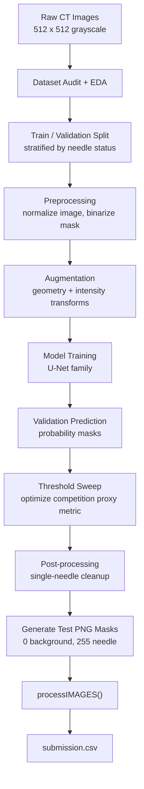
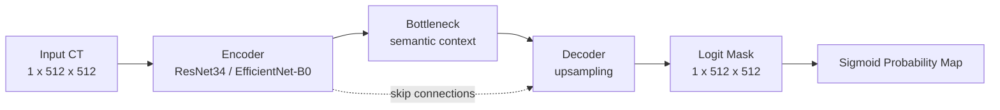
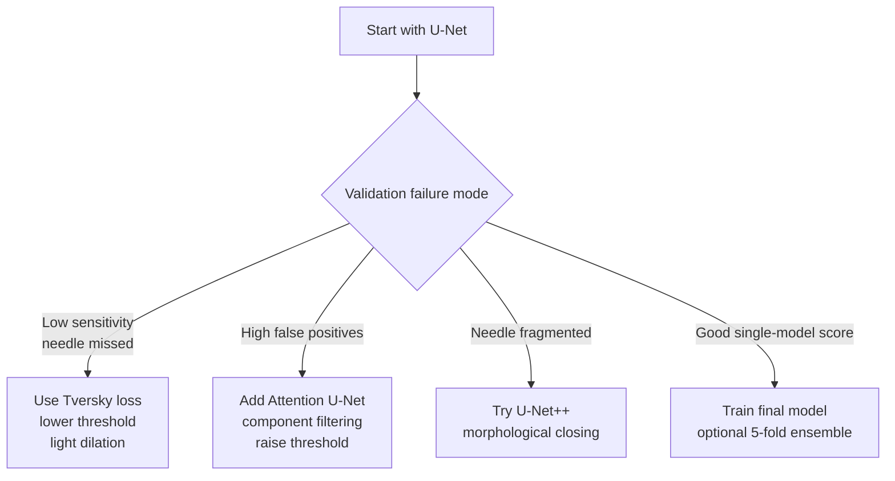
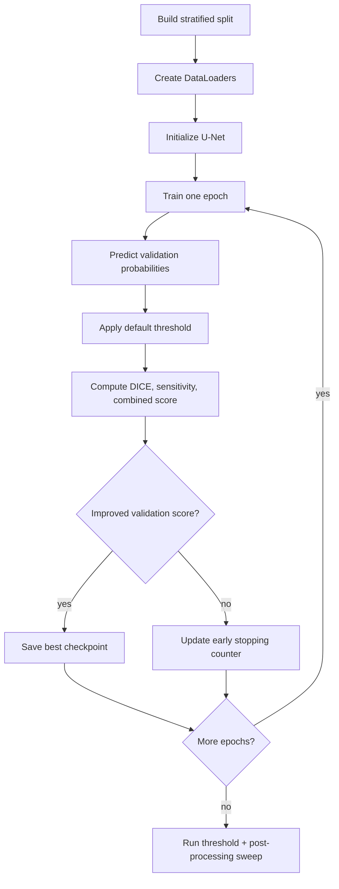
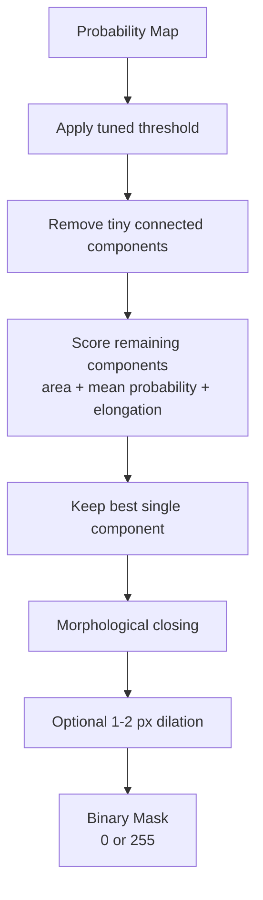
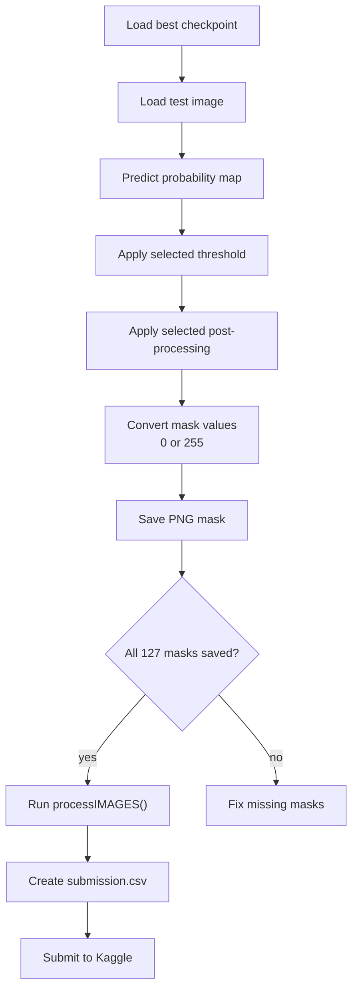

# Needle Segmentation Action Plan

## 1. Project Overview

The goal of this project is to build a binary image segmentation model for CT scans that identifies the needle structure with high precision and high sensitivity. The final Kaggle submission will be generated from prediction segmentation masks saved as `.png` files.

For every output mask:

- Needle pixels are the positive class and must be white: `255`.
- Background pixels are the negative class and must be black: `0`.
- Each mask must preserve the original image size: `512 x 512`.
- The final `.png` masks must be compatible with the provided `processIMAGES()` function, which will convert the masks into `submission.csv`.

> **Core Challenge**
>
> The needle is a very small foreground object in a large CT image. In the confirmed training data, the median positive mask area is roughly `373` pixels out of `262,144` total pixels. This means more than `99.8%` of most images is background. A normal pixel accuracy objective would be misleading because a model can score high pixel accuracy by predicting mostly background while still failing the segmentation task.

### Confirmed Dataset Facts

The local project folder contains:

- `505` training images
- `505` training masks
- `127` test images
- all images are grayscale `512 x 512`
- `352` training masks with a needle present
- `153` empty training masks
- median positive mask area is approximately `373` pixels

Dataset layout:

```text
Bioengr 224B Spring 26 Project 1/
├── trainSet.csv
├── trainImages/
│   └── trainImages/
│       └── {imageID}.jpg
├── trainMasks/
│   └── trainMasks/
│       └── {imageID}_mask.png
└── testImages/
    └── testImages/
        └── {imageID}.jpg
```

`trainSet.csv` includes:

- `imageID`: identifier used in image and mask filenames
- `status`: `1` if the needle is present, `0` if no needle is present
- `mask`: encoded mask pixels, with `-100` indicating an empty mask

---

## 2. End-to-End Pipeline



Implementation should be organized around two workflows:

- A notebook for EDA, visual inspection, overlays, and qualitative error analysis.
- Scripts for reproducible training, validation, inference, and mask export.

Recommended future structure:

```text
project/
├── NEEDLE_SEGMENTATION_ACTION_PLAN.md
├── notebooks/
│   └── 01_eda_and_visual_checks.ipynb
├── src/
│   ├── dataset.py
│   ├── metrics.py
│   ├── models.py
│   ├── postprocess.py
│   ├── train.py
│   └── infer.py
├── outputs/
│   ├── checkpoints/
│   ├── validation_overlays/
│   └── test_masks/
└── requirements.txt
```

---

## 3. Metric Strategy

The uploaded Kaggle evaluation criteria define a composite metric that combines DICE coefficient and sensitivity:

```text
Score = alpha * DICE + (1 - alpha) * Sensitivity
```

The competition does not disclose `alpha`, so local validation should not optimize only one assumed score. Instead, every experiment should report DICE, sensitivity, and composite scores for multiple plausible alpha values.

> **Metric Strategy**
>
> DICE rewards overlap quality and penalizes both false positives and false negatives. Sensitivity rewards finding as much of the needle as possible. Because the needle is thin and sparse, the model should be tuned to avoid missing needle pixels, but not by producing broad masks that destroy DICE. Since `alpha` is hidden, threshold and post-processing choices should be robust across sensitivity-heavy, balanced, and DICE-heavy scoring assumptions.

Evaluation definitions from the project criteria:

```text
DICE = (2 * |X intersection Y| + epsilon) / (|X| + |Y| + epsilon)

Sensitivity = (|X intersection Y| + epsilon) / (|Y| + epsilon)
```

where:

- `X` is the set of positive pixels in the predicted mask.
- `Y` is the set of positive pixels in the ground-truth mask.
- `epsilon` is a small constant used to avoid division by zero.
- For empty ground-truth masks, sensitivity is treated as perfect only when the prediction is also empty; non-empty predictions on empty ground truth should be penalized.

Recommended local reporting:

- `alpha = 0.25`: sensitivity-heavy score
- `alpha = 0.50`: balanced score
- `alpha = 0.75`: DICE-heavy score
- final model selection should favor methods that perform well across all three

Definitions:

```python
import torch


def dice_score(pred_mask, true_mask, eps=1e-7):
    """Compute binary DICE score.

    pred_mask and true_mask should be binary tensors with values 0 or 1.
    """
    pred_mask = pred_mask.float()
    true_mask = true_mask.float()

    intersection = (pred_mask * true_mask).sum()
    denominator = pred_mask.sum() + true_mask.sum()

    if denominator == 0:
        return torch.tensor(1.0, device=pred_mask.device)

    return (2.0 * intersection + eps) / (denominator + eps)


def sensitivity_score(pred_mask, true_mask, eps=1e-7):
    """Compute binary sensitivity / recall."""
    pred_mask = pred_mask.float()
    true_mask = true_mask.float()

    true_positive = (pred_mask * true_mask).sum()
    false_negative = ((1.0 - pred_mask) * true_mask).sum()

    if true_mask.sum() == 0:
        return torch.tensor(1.0, device=pred_mask.device) if pred_mask.sum() == 0 else torch.tensor(0.0, device=pred_mask.device)

    return (true_positive + eps) / (true_positive + false_negative + eps)


def competition_metric(pred_mask, true_mask, alpha=0.5):
    """Compute the project composite metric for an assumed alpha.

    Kaggle does not disclose alpha, so validation should report multiple
    alpha values instead of relying only on alpha=0.5.
    """
    dice = dice_score(pred_mask, true_mask)
    sensitivity = sensitivity_score(pred_mask, true_mask)
    return alpha * dice + (1.0 - alpha) * sensitivity


def metric_report(pred_mask, true_mask):
    dice = dice_score(pred_mask, true_mask)
    sensitivity = sensitivity_score(pred_mask, true_mask)
    return {
        "dice": dice,
        "sensitivity": sensitivity,
        "score_alpha_025": competition_metric(pred_mask, true_mask, alpha=0.25),
        "score_alpha_050": competition_metric(pred_mask, true_mask, alpha=0.50),
        "score_alpha_075": competition_metric(pred_mask, true_mask, alpha=0.75),
    }
```

Validation should report:

- mean DICE
- mean sensitivity
- mean composite score for `alpha = 0.25`
- mean composite score for `alpha = 0.50`
- mean composite score for `alpha = 0.75`
- score on positive-mask images only
- score on empty-mask images only
- number of all-empty predictions
- number of overfilled predictions

---

## 4. Dataset Loading And Preprocessing

### Path Constants

```python
from pathlib import Path

PROJECT_ROOT = Path("/Users/moulikchatterjee/Downloads/Bioengr 224B Spring 26 Project 1")

TRAIN_IMAGE_DIR = PROJECT_ROOT / "trainImages" / "trainImages"
TRAIN_MASK_DIR = PROJECT_ROOT / "trainMasks" / "trainMasks"
TEST_IMAGE_DIR = PROJECT_ROOT / "testImages" / "testImages"
TRAIN_CSV = PROJECT_ROOT / "trainSet.csv"

OUTPUT_DIR = PROJECT_ROOT / "outputs"
CHECKPOINT_DIR = OUTPUT_DIR / "checkpoints"
TEST_MASK_DIR = OUTPUT_DIR / "test_masks"
```

### Image And Mask Loading

```python
import cv2
import numpy as np


def load_image(image_path):
    """Load a grayscale CT image as float32 in [0, 1]."""
    image = cv2.imread(str(image_path), cv2.IMREAD_GRAYSCALE)
    if image is None:
        raise FileNotFoundError(f"Could not load image: {image_path}")

    image = image.astype(np.float32) / 255.0
    return image


def load_binary_mask(mask_path):
    """Load a mask and convert any positive value to 1."""
    mask = cv2.imread(str(mask_path), cv2.IMREAD_GRAYSCALE)
    if mask is None:
        raise FileNotFoundError(f"Could not load mask: {mask_path}")

    mask = (mask > 0).astype(np.float32)
    return mask
```

### Recommended Preprocessing

- Keep full `512 x 512` resolution.
- Normalize each image to `[0, 1]`.
- Optionally compare against z-score normalization:

```python
def zscore_normalize(image, eps=1e-6):
    return (image - image.mean()) / (image.std() + eps)
```

- Convert masks to binary values:
  - `mask > 0` becomes `1`
  - `mask == 0` remains `0`
- During export only, convert predictions to:
  - background `0`
  - needle `255`

### Augmentation Plan

Use augmentations that preserve the physical plausibility of a needle in CT:

- horizontal flip
- vertical flip
- rotation up to 180 degrees
- small affine transforms
- brightness and contrast shifts
- mild Gaussian noise
- mild blur

Avoid:

- aggressive elastic transforms that bend the needle unrealistically
- large crops that may remove the needle
- downsampling that erases thin mask structures

Example Albumentations setup:

```python
import albumentations as A


train_transforms = A.Compose(
    [
        A.HorizontalFlip(p=0.5),
        A.VerticalFlip(p=0.5),
        A.Rotate(limit=180, border_mode=cv2.BORDER_CONSTANT, value=0, mask_value=0, p=0.7),
        A.ShiftScaleRotate(
            shift_limit=0.05,
            scale_limit=0.10,
            rotate_limit=20,
            border_mode=cv2.BORDER_CONSTANT,
            value=0,
            mask_value=0,
            p=0.5,
        ),
        A.RandomBrightnessContrast(p=0.4),
        A.GaussNoise(p=0.2),
        A.Blur(blur_limit=3, p=0.15),
    ]
)

valid_transforms = None
```

---

## 5. PyTorch Dataset Skeleton

Use a stratified split based on `status` so both needle-present and empty-mask images appear in training and validation.

```python
import pandas as pd
import torch
from torch.utils.data import Dataset
from sklearn.model_selection import train_test_split


def build_split(train_csv, valid_size=0.2, seed=42):
    df = pd.read_csv(train_csv)

    train_df, valid_df = train_test_split(
        df,
        test_size=valid_size,
        random_state=seed,
        stratify=df["status"],
    )

    return train_df.reset_index(drop=True), valid_df.reset_index(drop=True)


class NeedleSegmentationDataset(Dataset):
    def __init__(self, dataframe, image_dir, mask_dir=None, transforms=None, is_test=False):
        self.df = dataframe.reset_index(drop=True)
        self.image_dir = Path(image_dir)
        self.mask_dir = Path(mask_dir) if mask_dir is not None else None
        self.transforms = transforms
        self.is_test = is_test

    def __len__(self):
        return len(self.df)

    def __getitem__(self, idx):
        row = self.df.iloc[idx]
        image_id = str(row["imageID"])
        image_path = self.image_dir / f"{image_id}.jpg"

        image = load_image(image_path)

        if self.is_test:
            if self.transforms:
                augmented = self.transforms(image=image)
                image = augmented["image"]

            image = torch.from_numpy(image).unsqueeze(0).float()
            return {"image": image, "image_id": image_id}

        mask_path = self.mask_dir / f"{image_id}_mask.png"
        mask = load_binary_mask(mask_path)

        if self.transforms:
            augmented = self.transforms(image=image, mask=mask)
            image = augmented["image"]
            mask = augmented["mask"]

        image = torch.from_numpy(image).unsqueeze(0).float()
        mask = torch.from_numpy(mask).unsqueeze(0).float()

        return {"image": image, "mask": mask, "image_id": image_id}
```

---

## 6. Model Roadmap

Recommended first model:

- U-Net
- encoder: ResNet34 or EfficientNet-B0
- input channels: `1`
- output classes: `1`
- activation during training: none, use logits
- activation during inference: sigmoid
- training resolution: `512 x 512`

Why U-Net fits this project:

- It is a standard biomedical segmentation architecture.
- Encoder-decoder structure captures context while restoring pixel-level detail.
- Skip connections help preserve thin structures.
- It is simpler and more reproducible than starting with larger segmentation models.



### Model Selection Decision Tree



### Architecture Options

| Model | When to use | Benefit | Cost |
| --- | --- | --- | --- |
| U-Net | First implementation | Strong biomedical baseline | Lowest complexity |
| Attention U-Net | If false positives dominate | Focuses decoder on relevant structures | Moderate complexity |
| U-Net++ | If masks are fragmented | Better multiscale feature fusion | Higher training cost |
| DeepLabV3+ | If context matters more than detail | Strong semantic context | Less ideal for very thin objects |

### Optional `segmentation_models_pytorch` Model

```python
import segmentation_models_pytorch as smp


def build_model():
    model = smp.Unet(
        encoder_name="resnet34",
        encoder_weights="imagenet",
        in_channels=1,
        classes=1,
        activation=None,
    )
    return model
```

If pretrained RGB weights are used with `in_channels=1`, verify that the library correctly adapts the first convolution. If not, use no pretrained weights or manually adapt the first layer.

---

## 7. Loss Functions

Start with:

```text
Loss = DiceLoss + BCEWithLogitsLoss
```

If validation sensitivity is low:

```text
Loss = DiceLoss + TverskyLoss
```

If false positives are high:

```text
Loss = DiceLoss + FocalLoss
```

Example loss skeleton:

```python
import torch.nn as nn


class DiceLoss(nn.Module):
    def __init__(self, eps=1e-7):
        super().__init__()
        self.eps = eps

    def forward(self, logits, targets):
        probs = torch.sigmoid(logits)
        probs = probs.view(probs.size(0), -1)
        targets = targets.view(targets.size(0), -1)

        intersection = (probs * targets).sum(dim=1)
        denominator = probs.sum(dim=1) + targets.sum(dim=1)
        dice = (2.0 * intersection + self.eps) / (denominator + self.eps)
        return 1.0 - dice.mean()


class BCEDiceLoss(nn.Module):
    def __init__(self):
        super().__init__()
        self.bce = nn.BCEWithLogitsLoss()
        self.dice = DiceLoss()

    def forward(self, logits, targets):
        return self.bce(logits, targets) + self.dice(logits, targets)
```

Tversky loss skeleton:

```python
class TverskyLoss(nn.Module):
    def __init__(self, alpha=0.3, beta=0.7, eps=1e-7):
        super().__init__()
        self.alpha = alpha
        self.beta = beta
        self.eps = eps

    def forward(self, logits, targets):
        probs = torch.sigmoid(logits)
        probs = probs.view(probs.size(0), -1)
        targets = targets.view(targets.size(0), -1)

        tp = (probs * targets).sum(dim=1)
        fp = (probs * (1.0 - targets)).sum(dim=1)
        fn = ((1.0 - probs) * targets).sum(dim=1)

        score = (tp + self.eps) / (tp + self.alpha * fp + self.beta * fn + self.eps)
        return 1.0 - score.mean()
```

---

## 8. Training Plan

Recommended defaults:

- optimizer: `AdamW`
- learning rate: `1e-3`
- scheduler: `ReduceLROnPlateau` on validation score or validation loss
- batch size: largest that fits GPU memory, likely `4` to `16`
- epochs: `50` to `150`
- early stopping patience: `15`
- save checkpoint by best validation competition proxy score

Training and validation loop:



Training loop skeleton:

```python
from torch.utils.data import DataLoader
import torch


def train_one_epoch(model, loader, optimizer, criterion, device):
    model.train()
    running_loss = 0.0

    for batch in loader:
        images = batch["image"].to(device)
        masks = batch["mask"].to(device)

        optimizer.zero_grad(set_to_none=True)
        logits = model(images)
        loss = criterion(logits, masks)
        loss.backward()
        optimizer.step()

        running_loss += loss.item() * images.size(0)

    return running_loss / len(loader.dataset)


@torch.no_grad()
def predict_probabilities(model, loader, device):
    model.eval()
    predictions = []
    targets = []
    image_ids = []

    for batch in loader:
        images = batch["image"].to(device)
        logits = model(images)
        probs = torch.sigmoid(logits).cpu()

        predictions.append(probs)
        if "mask" in batch:
            targets.append(batch["mask"])
        image_ids.extend(batch["image_id"])

    predictions = torch.cat(predictions, dim=0)
    targets = torch.cat(targets, dim=0) if targets else None

    return predictions, targets, image_ids
```

Experiment log fields:

```text
run_id
date
model
encoder
loss
image_normalization
augmentations
train_split_seed
best_epoch
threshold
postprocess_settings
valid_dice
valid_sensitivity
valid_combined_score
notes
```

---

## 9. Threshold Tuning

Do not assume a probability threshold of `0.5`.

Thin structures often benefit from a lower threshold because the model may assign uncertain probabilities to true needle boundary pixels. Thresholds must be selected using validation predictions.

Threshold sweep:

```python
import numpy as np


@torch.no_grad()
def evaluate_thresholds(probabilities, targets, thresholds):
    results = []

    for threshold in thresholds:
        pred_masks = (probabilities >= threshold).float()

        dice_values = []
        sensitivity_values = []
        combined_values = []

        for pred_mask, true_mask in zip(pred_masks, targets):
            dice = dice_score(pred_mask, true_mask)
            sensitivity = sensitivity_score(pred_mask, true_mask)
            combined = competition_metric(pred_mask, true_mask)

            dice_values.append(float(dice))
            sensitivity_values.append(float(sensitivity))
            combined_values.append(float(combined))

        results.append(
            {
                "threshold": float(threshold),
                "dice": float(np.mean(dice_values)),
                "sensitivity": float(np.mean(sensitivity_values)),
                "combined": float(np.mean(combined_values)),
            }
        )

    return sorted(results, key=lambda row: row["combined"], reverse=True)


thresholds = np.arange(0.05, 0.95, 0.05)
```

Selection rule:

- choose the threshold that maximizes the exact validation competition metric
- if scores are tied, prefer the threshold with better sensitivity unless false positives are visually severe
- record the selected threshold in the experiment log

---

## 10. Post-Processing Plan

Since each test scan is expected to contain exactly one needle, post-processing should enforce a single dominant needle-like structure.

> **Submission Warning**
>
> Final masks should be binary `.png` files containing only `0` and `255`. They should preserve the original `512 x 512` shape and use filenames expected by `processIMAGES()`. Before running `processIMAGES()`, verify that the number of generated masks equals the number of test images.

Post-processing pipeline:



Connected-component post-processing skeleton:

```python
import cv2
import numpy as np


def postprocess_probability_map(
    prob_map,
    threshold,
    min_area=20,
    close_kernel_size=3,
    dilation_iterations=0,
):
    """Convert a probability map into a cleaned binary needle mask.

    prob_map should be a 2D numpy array in [0, 1].
    Returns a uint8 mask with values 0 or 1.
    """
    binary = (prob_map >= threshold).astype(np.uint8)

    num_labels, labels, stats, _ = cv2.connectedComponentsWithStats(binary, connectivity=8)

    best_label = 0
    best_score = -1.0

    for label in range(1, num_labels):
        area = stats[label, cv2.CC_STAT_AREA]
        if area < min_area:
            continue

        component = labels == label
        mean_prob = float(prob_map[component].mean())

        width = stats[label, cv2.CC_STAT_WIDTH]
        height = stats[label, cv2.CC_STAT_HEIGHT]
        elongation = max(width, height) / max(1, min(width, height))

        score = area * mean_prob * max(1.0, elongation)

        if score > best_score:
            best_score = score
            best_label = label

    cleaned = np.zeros_like(binary, dtype=np.uint8)
    if best_label > 0:
        cleaned[labels == best_label] = 1

    if close_kernel_size > 0:
        kernel = np.ones((close_kernel_size, close_kernel_size), dtype=np.uint8)
        cleaned = cv2.morphologyEx(cleaned, cv2.MORPH_CLOSE, kernel)

    if dilation_iterations > 0:
        kernel = np.ones((3, 3), dtype=np.uint8)
        cleaned = cv2.dilate(cleaned, kernel, iterations=dilation_iterations)

    return cleaned.astype(np.uint8)
```

Post-processing parameters to tune on validation:

- threshold: `0.05` to `0.90`
- minimum component area: `5`, `10`, `20`, `40`, `80`
- closing kernel size: `0`, `3`, `5`
- dilation iterations: `0`, `1`, `2`

Do not tune these on the test set visually. Use validation first, then inspect test predictions only for obvious export failures.

---

## 11. Submission Generation

Final Kaggle submission flow:



Test mask export:

```python
from pathlib import Path
import cv2
import torch


@torch.no_grad()
def export_test_masks(model, test_loader, output_dir, device, threshold, postprocess_kwargs):
    output_dir = Path(output_dir)
    output_dir.mkdir(parents=True, exist_ok=True)

    model.eval()

    for batch in test_loader:
        images = batch["image"].to(device)
        image_ids = batch["image_id"]

        logits = model(images)
        probs = torch.sigmoid(logits).cpu().numpy()

        for prob, image_id in zip(probs, image_ids):
            prob_map = prob[0]
            binary_mask = postprocess_probability_map(
                prob_map,
                threshold=threshold,
                **postprocess_kwargs,
            )

            png_mask = (binary_mask * 255).astype("uint8")
            output_path = output_dir / f"{image_id}_mask.png"
            cv2.imwrite(str(output_path), png_mask)
```

Export validation checks:

```python
def validate_exported_masks(mask_dir, expected_count=127):
    mask_paths = sorted(Path(mask_dir).glob("*.png"))
    assert len(mask_paths) == expected_count, f"Expected {expected_count}, found {len(mask_paths)}"

    for path in mask_paths:
        mask = cv2.imread(str(path), cv2.IMREAD_GRAYSCALE)
        assert mask is not None, f"Could not read {path}"
        assert mask.shape == (512, 512), f"Bad shape for {path}: {mask.shape}"

        values = set(np.unique(mask).tolist())
        assert values.issubset({0, 255}), f"Non-binary values in {path}: {values}"
```

After this check passes, run the provided Kaggle helper:

```python
processIMAGES()
```

---

## 12. Experiment Roadmap

### Phase 1: Dataset Audit

Goals:

- verify file pairing
- inspect image and mask examples
- confirm empty-mask distribution
- inspect positive pixel counts
- overlay masks on CT images

Deliverables:

- EDA notebook
- plots of mask area distribution
- examples of successful and difficult masks

Acceptance criteria:

- every training image has a matching mask
- every mask is `512 x 512`
- all mask values can be safely binarized with `mask > 0`

### Phase 2: Classical Baseline

Goals:

- build a simple threshold / morphology baseline in `baseline_model`
- build a second candidate baseline using Canny edges plus probabilistic Hough-line detection
- establish a minimum score for comparison
- understand whether the needle is consistently brighter or line-like

Deliverables:

- baseline validation DICE
- baseline validation sensitivity
- composite validation scores for `alpha = 0.25`, `0.50`, and `0.75`
- qualitative overlay grid
- optional binary test-mask export for the best classical baseline

Acceptance criteria:

- baseline produces non-empty masks on at least some positive validation images
- baseline exposes common false-positive structures
- validation metrics are written to `outputs/baseline_model/{method}/validation_metrics.csv`
- generated masks are binary `0/255` PNGs when using prediction mode

Current baseline scripts:

```text
baseline_model/
├── algorithms.py        # percentile, Otsu, and Hough-line segmentation
├── data_io.py           # data-root discovery, image loading, mask export
├── metrics.py           # DICE, sensitivity, hidden-alpha composite scores
├── run_baselines.py     # CLI for validation and test-mask export
└── README.md
```

Baseline validation commands:

```bash
.venv/bin/python -m baseline_model.run_baselines --mode validate --method percentile
.venv/bin/python -m baseline_model.run_baselines --mode validate --method hough
```

### Phase 3: U-Net Baseline

Goals:

- train U-Net with `DiceLoss + BCEWithLogitsLoss`
- validate with threshold `0.5`
- inspect failure modes

Deliverables:

- first checkpoint
- validation metrics
- validation overlays

Acceptance criteria:

- model predicts localized needle regions
- validation score beats classical baseline
- no export shape or dtype issues

### Phase 4: Metric Optimization

Goals:

- sweep thresholds
- tune post-processing
- optimize combined validation score

Deliverables:

- best threshold
- best post-processing settings
- validation metric table

Acceptance criteria:

- selected settings improve combined score over raw `0.5` threshold
- sensitivity remains high without severe DICE collapse

### Phase 5: Improved Model

Goals:

- try Tversky loss if sensitivity is weak
- try Attention U-Net if false positives dominate
- try U-Net++ if masks are fragmented

Deliverables:

- comparison table across experiments
- chosen final model

Acceptance criteria:

- final model has the best validation competition proxy score
- improvements are confirmed on validation, not only visual inspection

### Phase 6: Final Inference

Goals:

- train final model on full training set or train with best validation split depending on class rules
- generate all test masks
- validate exported PNGs
- run `processIMAGES()`

Deliverables:

- `outputs/test_masks/*.png`
- `submission.csv`

Acceptance criteria:

- exactly `127` test masks generated
- every mask is `512 x 512`
- every mask contains only `0` and `255`
- `processIMAGES()` runs successfully

---

## 13. Evaluation Benchmarks

Minimum acceptable checks:

- predictions are not accidentally inverted
- predictions are not all white
- positive validation examples usually receive non-empty masks
- empty validation examples are not massively overfilled

Useful model target:

- validation sensitivity above `0.80`
- validation DICE clearly above classical baseline
- stable behavior across random validation samples

Competitive target:

- validation sensitivity above `0.90`
- strong DICE after threshold and post-processing tuning
- no obvious broken predictions in worst-case visual review

Final target:

- best validation competition proxy score
- robust test mask export
- clean compatibility with `processIMAGES()`

---

## 14. Risks And Mitigations

| Risk | Why it matters | Mitigation |
| --- | --- | --- |
| Severe foreground imbalance | Model may learn background-only predictions | Dice/Tversky loss, positive-class monitoring, threshold tuning |
| Low sensitivity | Missed needle pixels hurt sensitivity and DICE | Lower threshold, Tversky loss, light dilation |
| False positives from bright anatomy/artifacts | Extra pixels reduce DICE | connected-component filtering, attention model, area/shape constraints |
| Fragmented needle prediction | Broken masks reduce overlap | morphological closing, U-Net++, augmentation tuning |
| Empty training masks conflict with test assumption | Model may predict blank masks on test | include empty masks during training but enforce single-component post-processing for test |
| Wrong PNG format | `processIMAGES()` may fail or submit wrong masks | export validation checks for count, shape, dtype, binary values |
| Overfitting small dataset | Public leaderboard may not generalize | stratified validation, augmentation, optional cross-validation |

---

## 15. Recommended Implementation Checklist

- [ ] Create `requirements.txt`.
- [ ] Create EDA notebook.
- [ ] Implement dataset loader.
- [ ] Implement DICE, sensitivity, and competition proxy metric.
- [ ] Implement visual overlay utility.
- [ ] Build classical baseline.
- [ ] Train U-Net baseline.
- [ ] Save best checkpoint by validation score.
- [ ] Run threshold sweep.
- [ ] Tune connected-component post-processing.
- [ ] Compare loss variants.
- [ ] Generate validation overlay grids.
- [ ] Generate test masks.
- [ ] Validate exported PNG masks.
- [ ] Run `processIMAGES()`.
- [ ] Submit `submission.csv` to Kaggle.

---

## 16. Final Recommended Default Configuration

Use this as the first serious implementation:

```yaml
model:
  architecture: U-Net
  encoder: resnet34
  pretrained: true
  input_channels: 1
  output_channels: 1
  image_size: [512, 512]

training:
  optimizer: AdamW
  learning_rate: 0.001
  batch_size: largest_that_fits_gpu
  epochs: 100
  early_stopping_patience: 15
  loss: BCEWithLogitsLoss + DiceLoss
  scheduler: ReduceLROnPlateau

validation:
  split: 80_20_stratified_by_status
  threshold_sweep: [0.05, 0.10, 0.15, ..., 0.90]
  selected_metric: exact_kaggle_combined_metric

postprocessing:
  keep_single_component: true
  min_area_grid: [5, 10, 20, 40, 80]
  close_kernel_grid: [0, 3, 5]
  dilation_grid: [0, 1, 2]

export:
  output_format: png
  mask_values: [0, 255]
  expected_shape: [512, 512]
```

This default is deliberately conservative: it prioritizes a strong, reproducible U-Net pipeline with validation-driven threshold and post-processing choices before moving to more complex models or ensembles.
